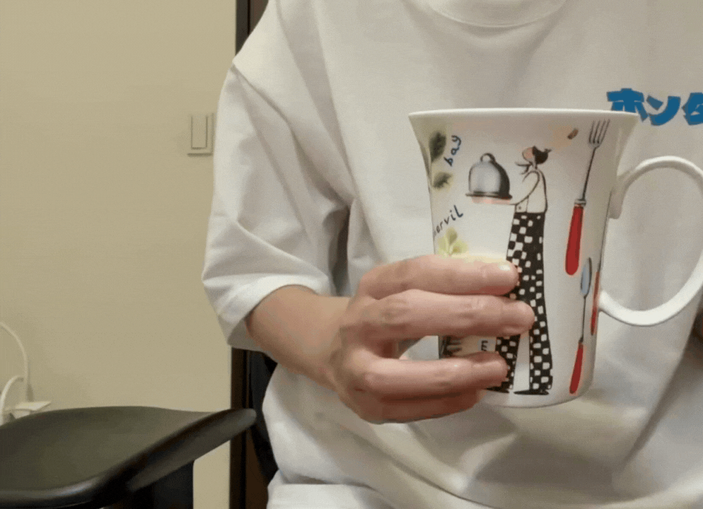
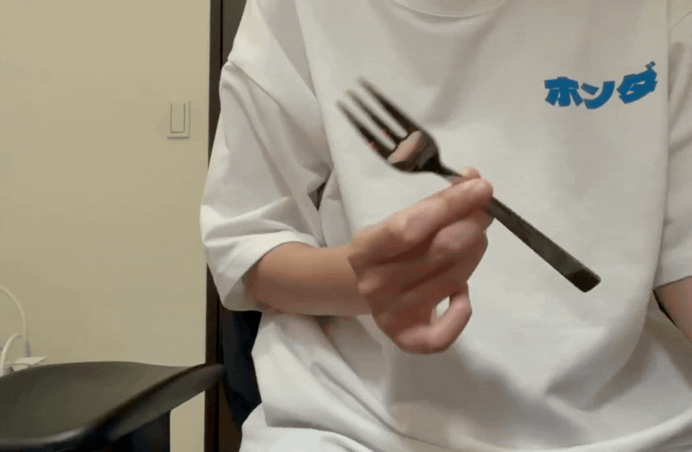

# YOLOv9_practise
YOLOv9練習


<p align="center">

  
  
</p>

## Dataset

```bash
https://www.kaggle.com/datasets/raunakgola/kitchenware-object-detection-dataset-yolo-format
```

## Reference

```bash
https://www.youtube.com/watch?v=tMwyxKttZd0&t
```
